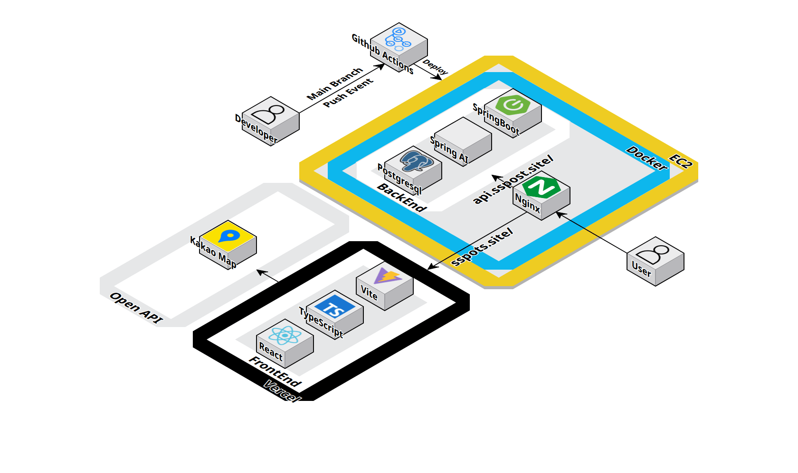

# 🏃🏻‍♂🏃🏻FitFinder - 성별, 연령, 위치, 선호 종목을 분석하여 최적의 운동 장소와 맞춤형 주간 루틴을 추천해주는 스포츠 큐레이션 서비스

## 1. 서비스 소개

FitFinder는 국민체육진흥공단(KSPO)의 공공 체육·생활 스포츠 데이터를 기반으로,
사용자의 성별, 연령, 위치, 관심 종목, 운동 가능 시간대를 반영해 가장 적합한 운동 프로그램을 추천해 주는 맞춤형 서비스입니다.

사용자는 복잡하게 검색할 필요 없이, 자신의 생활 패턴에 맞는 근처 운동 프로그램과 시설을 쉽게 확인할 수 있습니다. 더 나아가 FitFinder는 개인 조건과 주변 환경을 함께 고려해 일주일 운동 루틴까지 자동으로 구성해 주어,
운동 계획 세우는 부담을 덜어줍니다.

FitFinder는 공공 데이터를 활용해 누구나 자연스럽게 운동을 시작하고 꾸준히 유지할 수 있는 환경을 만드는 것을 목표로 합니다.

## 2. 백엔드 팀원 구성

<div align = "center">

|                                                              **김용범**                                                               |                                                              **소태호**                                                               |                                                                **나윤빈**                                                                |                                                              **박심인**                                                              |
|:----------------------------------------------------------------------------------------------------------------------------------:|:----------------------------------------------------------------------------------------------------------------------------------:|:-------------------------------------------------------------------------------------------------------------------------------------:|:---------------------------------------------------------------------------------------------------------------------------------:|
| [ <br/> @Bumnote](https://github.com/Bumnote) | [ <br/> @SoTaeHo](https://github.com/SoTaeHo) | [ <br/> @skdbsqls](https://github.com/skdbsqls) | [ <br/> @IMCTZN](https://github.com/IMCTZN) |
|                                                            Backend, AI                                                             |                                                                 AI                                                                 |                                                               Frontend                                                                |                                                               Data                                                                |

</div>

## 3. 개발 환경

| 항목         | 버전/설정                                      |
  |------------|--------------------------------------------|
| Framework  | Spring Boot 3.5.8                          |
| JDK        | Temurin 21                                 |
| AI         | Spring AI 1.1.0                            |
| Build Tool | Gradle 9.2.1                               |
| Database   | PostgreSQL 15                              |
| 기타         | Docker 24+, Docker Compose, GitHub Actions |

### 실행 프로필

- `local`: 로컬 개발용, `.env`와 `application-secret.yml`을 통해 DB/OpenAI 키 주입
- `prod`: Docker Compose 및 EC2 배포에서 사용, `.env`와 Secrets로 환경 분리

## 4. 아키텍처 구조


## 5. 채택한 개발 기술

- **Spring Web + Validation**: REST API, DTO 검증
- **Spring Data JPA + Querydsl 5**: 동적 조건 검색(`ProgramRepositoryImpl`)과 Slice + 커서 기반 무한 스크롤 페이징
- **Spring AI 1.1**: `ChatClient`로 OpenAI Chat Completions 호출, Prompt 활용한 JSON 응답 파싱
- **Swagger(springdoc-openapi 2.8.6)**: 서비스 로직의 오염을 없애기 위한 Swagger 전용 인터페이스를 만들어 API 명세 자동화
- **Global Exception Handling**: `GlobalExceptionHandler`를 통한 `CustomException` 커스텀 예외 및 `ApiResponse` 공통 응답
- **Docker & Docker Compose**: `spots-app`, `postgres`, `nginx`, `certbot` 스택 운영
- **CI/CD**: GitHub Actions `CI.yml` 빌드 & 도커 푸시, `CD.yml` EC2 자동 배포
- **Infra Scripts**: `scripts/deploy.sh`로 SSL 발급/갱신 + 서비스 롤링

## 6. 프로젝트 구조

```
spots/
├── build.gradle / settings.gradle
├── docker-compose.yml          # app + db + nginx + certbot
├── Dockerfile / Dockerfile.local
├── scripts/deploy.sh
├── nginx/
│   ├── nginx-prod.conf         # 운영 reverse proxy
│   └── nginx-cert-setup.conf   # Certbot 임시 설정
├── src/
│   └── main/
│       ├── java/com/spots/
│       │   ├── SpotsApplication.java
│       │   ├── domain/
│       │   │   ├── program/    # controller/service/repository/entity/dto
│       │   │   ├── facility/
│       │   │   ├── transport/
│       │   │   ├── ai/
│       │   │   └── category/
│       │   ├── global/         # config, exception, swagger
│       │   └── swagger/
│       └── resources/
│           ├── application*.yml
│           └── prompt/routine.prompt
└── .github/workflows/CI.yml, CD.yml
```

## 7. 개발한 기능 설명

1. **프로그램 조건 검색 API (`ProgramController#searchPrograms`)**
    - 입력: 성별, 연령, 좌표, 선호 종목, 요일, 시간, 페이지 파라미터.
    - Querydsl에서 거리 필터(Haversine)·카테고리·요일·시간 필터를 모두 조합해 Slice 응답을 반환합니다.
2. **프로그램 상세 조회 (`ProgramService#getProgram`)**
    - Program + Facility + Transit 데이터를 집계해 이름, 대상, 요일, 가격, 예약 URL, 시설 주소, 대중교통 TOP2를 제공합니다.
3. **시설/교통 데이터 처리**
    - `Facility`, `FacilityTransit` 엔티티 및 `TransitRepository` Native Query로 랭크 기준 상위 2개 이동 수단을 도보 분 단위로 계산합니다.
4. **AI 기반 주간 루틴 생성 (`RecommendService`, `RecommendLLMService`)**
    - Program 검색 결과를 LLM 프롬프트(`routine.prompt`)에 삽입, OpenAI 응답을 `WeeklyRecommendResponse`로 역직렬화합니다.
5. **글로벌 예외/검증 체계**
    - `@Valid` DTO + `GlobalExceptionHandler` → `ApiResponse` 포맷으로 에러 메시지 일관성 유지, Swagger 예시 자동화를 통해 API 문서 신뢰성 확보합니다.
6. **운영 자동화**
    - GitHub Actions CI에서 Gradle clean build 및 Docker Hub Push를 수행합니다.
    - CD 워크플로우가 EC2로 `deploy.sh`와 설정을 전달해 Docker Compose 재기동, Certbot 자동 갱신 및 Nginx 재로드까지 수행합니다.

## 8. 활용한 데이터 출처

- 문화 빅데이터
  플랫폼: [공공체육시설 프로그램 정보](https://www.bigdata-culture.kr/bigdata/user/data_market/detail.do?id=c3b8fb69-307d-4ae7-ab42-d0314c89ef47)